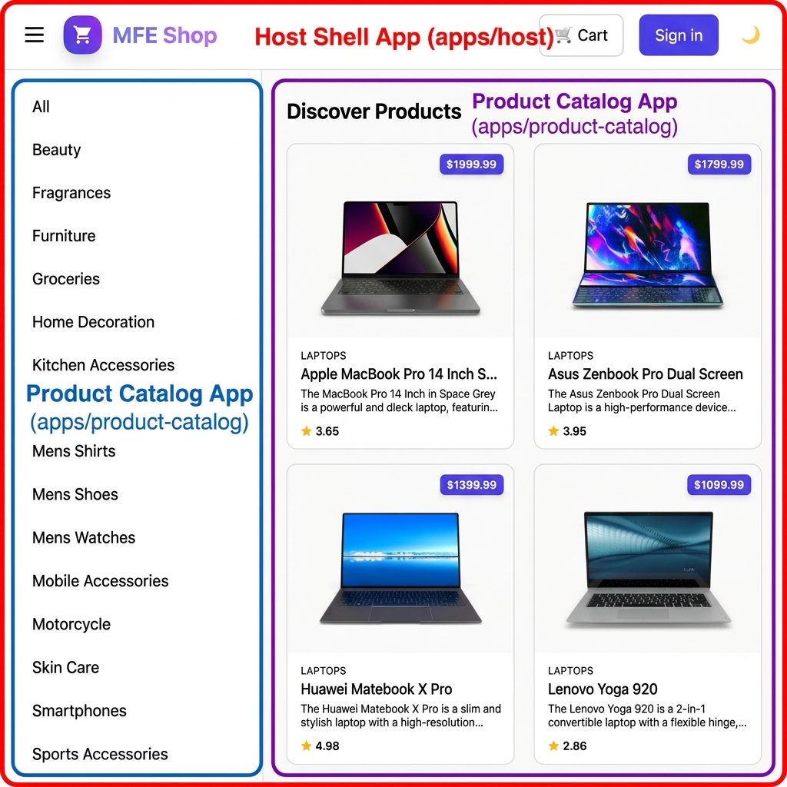
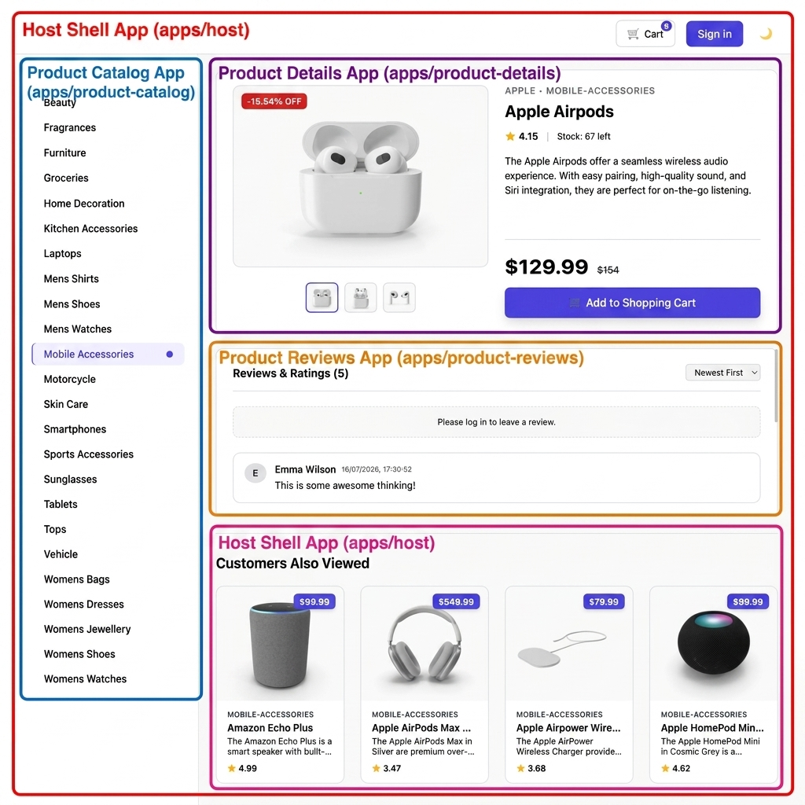

# 🚀 React Vite Module Federation Boilerplate (Micro Frontend)

[](https://micro-frontend-vite-boilerplate.netlify.app/)

[](https://react.dev/)
[](https://vitejs.dev/)
[](https://www.typescriptlang.org/)
[](https://github.com/originjs/vite-plugin-federation)
[](https://storybook.js.org/)
[](#-license)

> **A production-ready Micro Frontend (MFE) boilerplate built with React 19, Vite, Module Federation, TypeScript, Storybook 10, Zustand, and a local Mock API.**
>
> 🌐 **Live Production Demo**: [micro-frontend-vite-boilerplate.netlify.app](https://micro-frontend-vite-boilerplate.netlify.app/)
>
> **A complete E-Commerce Product Catalog demonstrating real-world Micro Frontend architecture built with React, Vite, Module Federation, Storybook, Zustand, and a local Mock API.**
>
> The goal of this project is to demonstrate how a large enterprise e-commerce application can be split into independently developed and deployed Micro-Frontends (MFEs).
>
> 📖 **Developer Workflows**: For instructions on running standalone commands, integrated hot-rebuild environments, and workspace scripts cataloging, refer to [workflow.md](./workflow.md).
>
> 🏗️ **MFE Boilerplate Guide**: To use this repository as a template or boilerplate for your own React Module Federation monorepo, see [BOILERPLATE.md](./BOILERPLATE.md).
>
> 🚀 **Deployment Guide**: For instructions on deploying the host and remotes to Netlify, see [DEPLOYMENT.md](./DEPLOYMENT.md).

## 📌 Table of Contents

- [✨ Features](#-features)
- [Preview & Screenshots](#preview--screenshots)
- [💡 Why this boilerplate?](#-why-this-boilerplate)
- [🚀 Use This Repository](#-use-this-repository)
- [🚀 Getting Started](#-getting-started)
- [🏗️ High-Level Architecture](#️-high-level-architecture)
- [📸 MFE Composition Diagram](#-mfe-composition-diagram)
- [⚙️ How Module Federation Works Here](#️-how-module-federation-works-here)
- [⚡ Performance Metrics](#-performance-metrics)
- [🗺️ Roadmap](#️-roadmap)
- [🛠️ Monorepo CLI Commands](#️-monorepo-cli-commands)
- [🤝 Contributing](#-contributing)
- [⭐ Support](#-support)
- [📄 License](#-license)

---

## ✨ Features

- ⚛️ React 19
- ⚡ Vite
- 🧩 Module Federation
- 📦 Shared Zustand Store
- 🎨 Storybook 10
- 🔐 Authentication
- 🌙 Dark Mode
- 🛒 Shopping Cart
- 📱 Responsive
- 🚀 Independent Deployment

---

## Preview & Screenshots

|                   Homepage (Light Theme)                   |                    Homepage (Dark Theme)                    |
| :--------------------------------------------------------: | :---------------------------------------------------------: |
|             |    |
|                     **Product Detail**                     |                    **Customer Reviews**                     |
|  |  |
|                     **Cart Dropdown**                      |                     **Sign In Screen**                      |
|             |                |

## 💡 Why this boilerplate?

Most Module Federation examples are:

- outdated
- webpack only
- incomplete
- not production ready

This repository demonstrates how to build scalable React Micro Frontends using Vite, Module Federation, Storybook, and Zustand with an enterprise-ready project structure.

---

## 🚀 Use This Repository

Click **Use this template** to create your own project.

No need to fork. The boilerplate is ready for production development.

---

## 🚀 Getting Started

To get started locally:

1. Clone your newly created repository:
   ```bash
   git clone <your-new-repo-url>
   cd micro-frontend-vite-boilerplate
   ```
2. Install the workspaces and dependencies:
   ```bash
   npm install
   ```
3. Start the interactive development build:
   ```bash
   npm run dev:mfe
   ```
   Open **[http://localhost:5005](http://localhost:5005)** inside your browser to start coding.

---

## 🏗️ High-Level Architecture

```
                          MFE Monorepo
                               │
                       Host (Container)
             [Auth, Routing, Layout, Shared Store]
                               │
         ┌─────────────────────┼─────────────────────┐
         ▼                     ▼                     ▼
  Product Catalog       Product Details       Product Reviews
     (MFE 1)               (MFE 2)               (MFE 3)
```

---

## 📸 MFE Composition Diagram

These diagrams show how the host container and remote micro-frontends compose the screens visually:

### 1. Home Catalog Page Composition



### 2. Product Detail & Reviews Page Composition



## ⚙️ How Module Federation Works Here

Each micro frontend is independently built and deployed while sharing common libraries at runtime using Module Federation:

1. **Host (`apps/host`)** requests remote entrypoints from target domains (e.g. `http://localhost:5001/assets/remoteEntry.js`).
2. **Remotes (`apps/product-catalog`, etc.)** expose React components which get dynamically loaded over the network only when the user navigates to those sub-routes.
3. Common dependencies like `react`, `react-dom`, and `zustand` are shared, ensuring that each library is only loaded **once** in the browser, matching the optimal bundle-sharing setup of a monolith.

---

## ⚡ Performance Metrics

The values below represent optimized builds running locally:

| Metric                     | Host Shell Container | Product Catalog MFE | Product Details MFE | Product Reviews MFE |
| :------------------------- | :------------------: | :-----------------: | :-----------------: | :-----------------: |
| **Startup Time (Dev)**     |        ~95ms         |        ~90ms        |        ~92ms        |        ~91ms        |
| **Build Time**             |        ~740ms        |       ~590ms        |       ~740ms        |       ~690ms        |
| **Production Bundle Size** |       ~106 kB        |       ~98 kB        |       ~98 kB        |       ~98 kB        |
| **Remote Entry script**    |          -           |       3.74 kB       |       3.44 kB       |       3.44 kB       |
| **Lighthouse Performance** |         99+          |         99+         |         99+         |         99+         |

> ℹ️ _Note: Measured on an Apple M4 using production builds. Results may vary depending on hardware and project size._

---

## 🗺️ Roadmap

- [x] **React 19 & TypeScript 5 support**
- [x] **Storybook 10 design system**
- [x] **Zustand shared store synchronization**
- [x] **Authentication & Mock API**
- [ ] **SSR (Server-Side Rendering) Support**
- [ ] **Docker & Kubernetes deployment templates**
- [ ] **Playwright E2E testing suite**
- [ ] **Turborepo / Nx Monorepo Migration**
- [ ] **AWS / Terraform deployment scripts**

---

## 🛠️ Monorepo CLI Commands

For the full developer guide, refer to the [workflow.md](./workflow.md) guide.

```bash
# Install Monorepo Workspaces
npm install

# Run All Apps in Integrated Dev Mode
npm run dev:mfe

# Compile Production Build Assets
npm run build

# Preview Static Builds Locally
npm run preview

# Format & Lint checks
npm run format
npm run lint

# Launch Storybook Components Library
npm run storybook
```

## 🤝 Contributing

Contributions, issues and feature requests are welcome.

If you'd like to improve this project, feel free to open an Issue or Pull Request.

---

## ⭐ Support

If this project helped you, consider giving it a star.

It helps more developers discover the project.

---

## 📄 License

This project is licensed under the MIT License. See the [LICENSE](./LICENSE) file for details.
