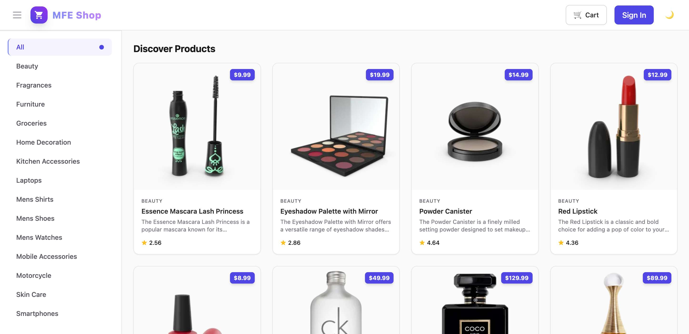
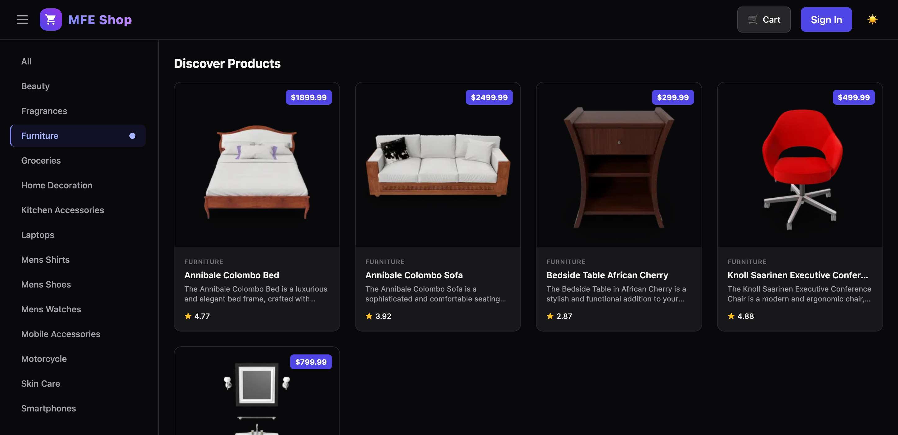
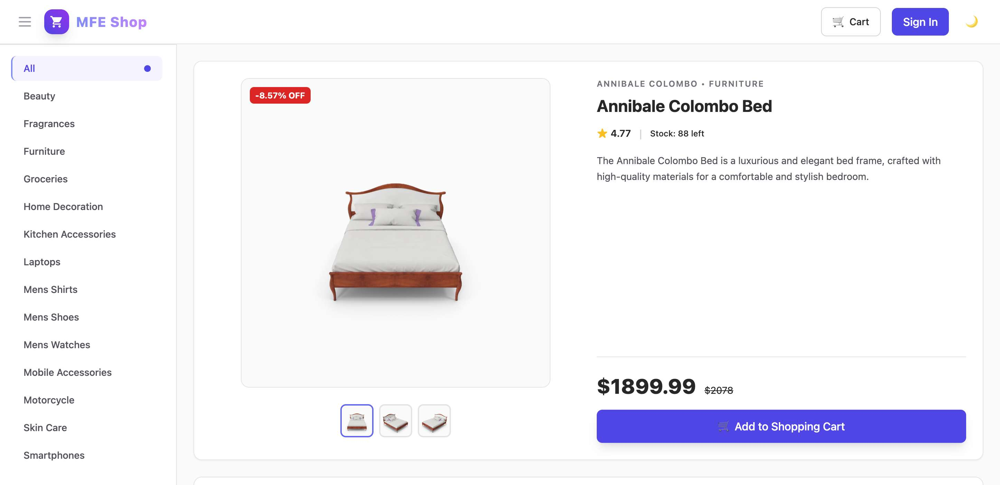
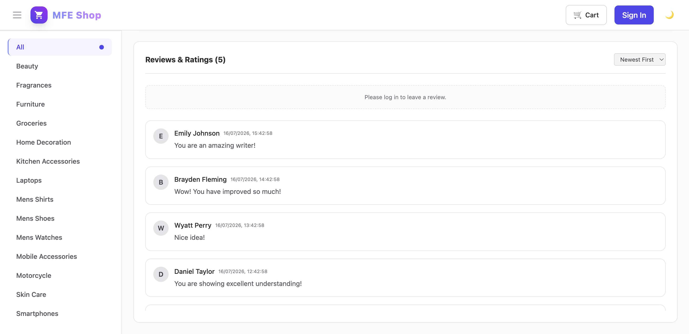
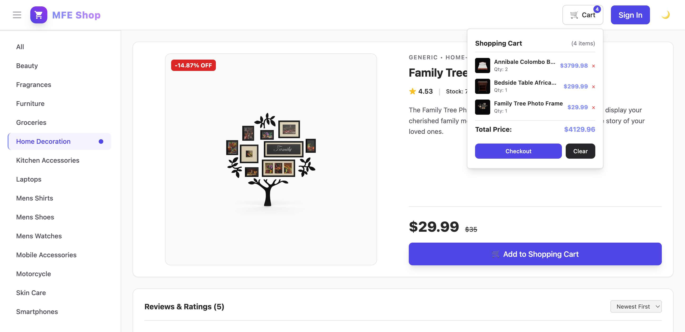
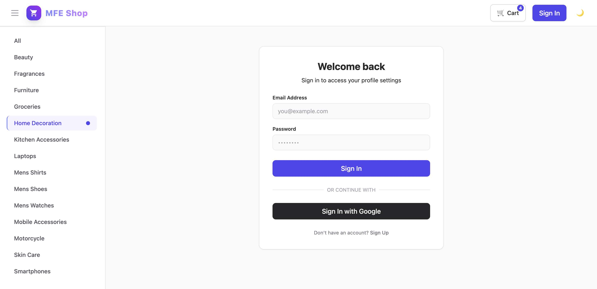

# MFE Boilerplate - E-Commerce Product Catalog (Micro-Frontend)

> 🔗 **Live Production Demo**: [micro-frontend-vite-boilerplate.netlify.app](https://micro-frontend-vite-boilerplate.netlify.app/)
>
> **A production-inspired E-Commerce Product Catalog platform built with React, Vite, Module Federation, Storybook, Zustand, and a local Mock API.**
>
> The goal of this project is to demonstrate how a large enterprise e-commerce application can be split into independently developed and deployed Micro-Frontends (MFEs).
>
> 📖 **Developer Workflows**: For instructions on running standalone commands, integrated hot-rebuild environments, and workspace scripts cataloging, refer to [workflow.md](./workflow.md).
>
> 🏗️ **MFE Boilerplate Guide**: To use this repository as a template or boilerplate for your own React Module Federation monorepo, see [BOILERPLATE.md](./BOILERPLATE.md).
>
> 🚀 **Deployment Guide**: For instructions on deploying the host and remotes to Netlify, see [DEPLOYMENT.md](./DEPLOYMENT.md).

## Preview & Screenshots

| Homepage (Light Theme) | Homepage (Dark Theme) |
| :---: | :---: |
|  |  |
| **Product Detail** | **Customer Reviews** |
|  |  |
| **Cart Dropdown** | **Sign In Screen** |
|  |  |

---

## 1. Project Goals

This project demonstrates:

- ✅ **Micro-Frontend Architecture**: Decomposing a large frontend application into smaller, self-contained apps.
- ✅ **Module Federation**: Dynamic runtime script loading and dependency sharing using Vite.
- ✅ **Independent Deployment**: Deploying each remote application independently without redeploying the host container.
- ✅ **Shared Authentication**: Unified authentication context propagating across micro-frontends.
- ✅ **Shared Global State**: Single-instance Zustand stores synchronized across runtime MFE boundaries.
- ✅ **Shared Design System**: Unified design tokens and reusable UI components documented with Storybook.
- ✅ **Enterprise Folder Structure**: Scalable monorepo workspace organization using npm workspaces.
- ✅ **TypeScript & Clean Architecture**: Clean separation of domains, types, hooks, and presentation layers.

---

## 2. Tech Stack

- **Framework**: React 19 & TypeScript
- **Bundler & Dev Server**: Vite (with Module Federation)
- **Styling**: Tailwind CSS & PostCSS
- **State Management**: Zustand (with window-scope cross-boundary synchronization)
- **Form Management**: React Hook Form & Zod
- **API Simulation**: Mock API utilizing public endpoints (dummyjson.com) and localStorage persistence
- **Documentation**: Storybook 10

---

## 3. High-Level Architecture

```
                          MFE Monorepo
                               │
                       Host (Container)
             [Auth, Routing, Layout, Shared Store]
                               │
         ┌─────────────────────┼─────────────────────┐
         ▼                     ▼                     ▼
  Product Catalog       Product Details       Product Reviews
     (MFE 1)               (MFE 2)               (MFE 3)
```

---

## 4. Applications (`/apps`)

- **`host`**: The shell application. Coordinates global routing, authentication, shared header/sidebar, and dynamic remote mounting.
- **`product-catalog`**: Remote MFE that displays product grids, categories selector, searches, and paginations. Exposes `ProductCatalogApp` and `CategorySelector`.
- **`product-details`**: Remote MFE showing detailed product specs, stock levels, image galleries, and the "Add to Cart" triggers. Exposes `ProductDetailsApp`.
- **`product-reviews`**: Remote MFE displaying customer reviews and dynamic feedback submissions. Exposes `ProductReviewsApp`.

---

## 5. Shared Packages (`/packages`)

- **`shared-ui`**: Reusable Tailwind design system components (Button, Avatar, Card, Spinner, Dropdown, Modal, ProductCard, ReviewCard).
- **`shared-store`**: Shared Zustand store singletons (Auth, Product, Cart, UI) mapped to window scope to avoid multi-instance memory leaks.
- **`shared-hooks`**: Unified Custom React Hooks (`useAuth`, `useProduct`, `useCart`, `useTheme`, `useSearch`).
- **`shared-utils`**: Common utility helper logic (currency/date formatters, search debouncers, country flag generators).
- **`shared-types`**: Core TypeScript interfaces shared across all remotes and libraries.
- **`mock-api`**: Simulated database client and authentication routines using REST API endpoints and `localStorage`.

---

## 6. Responsibilities & Domains

### Host Shell

- **Auth**: Manages user session state and sign-in/sign-out logic.
- **Shell Layout**: Renders global headers, sidebar navigation, dynamic breadcrumbs, and user profiles.
- **Global Cart**: Renders the checkout shopping cart drawer widget in the header.
- **Error Handlers**: Mounts error boundaries so failing remotes don't crash the container.

### Product Catalog MFE

- **Product Indexing**: Queries categories and product databases.
- **Search & Filters**: Handles keyword matches and category tag sorting.
- **Selections**: Updates the shared store's `selectedProduct` when a item card is clicked.

### Product Details MFE

- **Metadata Viewer**: Render details, price calculations, brand, and reviews count.
- **Galleries**: Displays primary product previews and high-res image switchers.
- **Checkout Integrator**: Dispatches `addToCart()` events back to the global checkout store.

### Product Reviews MFE

- **Feeds**: Displays list of comments and customer review cards for the selected product.
- **CRUD Operations**: Allows users to post reviews, edit comments, or delete feedback entries.

---

## 7. Shared State Model (Zustand)

Global state is managed by lightweight store slices synchronized on the window context:

```typescript
// Auth Store
user: User | null
loading: boolean
setUser(user: User | null)

// Product Store
selectedProduct: Product | null
activeCategory: string
setSelectedProduct(product: Product | null)
setActiveCategory(category: string)

// Cart Store
cartItems: CartItem[]
addToCart(product: Product)
removeFromCart(productId: number)
clearCart()

// UI Store
theme: 'light' | 'dark'
sidebarOpen: boolean
searchQuery: string
language: string
toggleTheme()
toggleSidebar()
setSearchQuery(query: string)
```

---

## 8. Local Mock Database Schema

In the absence of Firebase, components interact with the `mock-api` layer which simulates Firestore collections using browser `localStorage`:

```
Local Storage Key          Structure / Schema
───────────────────────────────────────────────────────────────────
mfe-auth-storage           { user: { uid, email, displayName, photoURL } }
mfe-cart-storage           { cartItems: [{ product, quantity }] }
mfe_comments_db            [{ id, productId, userName, message, createdAt }]
mfe_favorites_db           [{ uid, productIds: [] }]
```

---

## 9. Storybook Design Library (`packages/shared-ui`)

Includes standard documentation and test states for core UI elements:

- **Buttons**: Primary, secondary, outline, loading, and disabled states.
- **Cards**: General containers, product list cards, and review boxes.
- **Indicators**: Spinners, Badges, and Theme toggles.
- **Forms**: Search inputs, custom dropdown selectors, and modal overlays.

Run Storybook locally:

```bash
npm run storybook
```

---

## 10. Development & Verification Commands

For full workflow options, refer to [workflow.md](file:///Users/devprasan/Documents/video-management-software-with-MFE/workflow.md).

```bash
# Install Monorepo Workspaces
npm install

# Run All Apps in Dev / Watch Reload Mode
npm run dev:mfe

# Compile Production Build Assets
npm run build

# Preview Static Builds Locally
npm run preview

# Format & Lint Checks
npm run format
npm run lint
```

---

## 11. CI/CD Quality Controls

A GitHub Actions pipeline (`.github/workflows/ci.yml`) runs on push and pull requests to validate code quality:

1. **Dependency Installation**: Restores node modules cached between builds.
2. **Lint Validation**: Verifies code complies with project ESLint rules.
3. **Format Verification**: Assures files conform to Prettier styling limits.
4. **Compile Test**: Compiles all micro-frontends and libraries to verify Module Federation compatibility and bundle safety.
